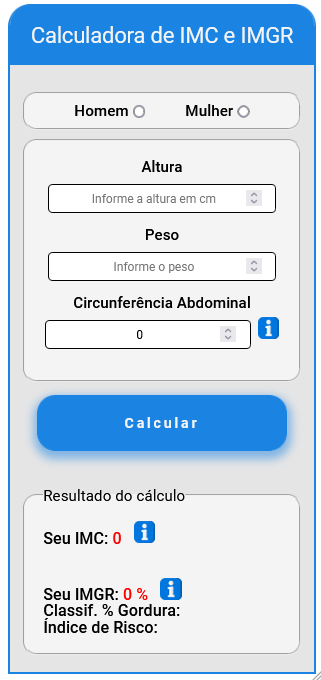
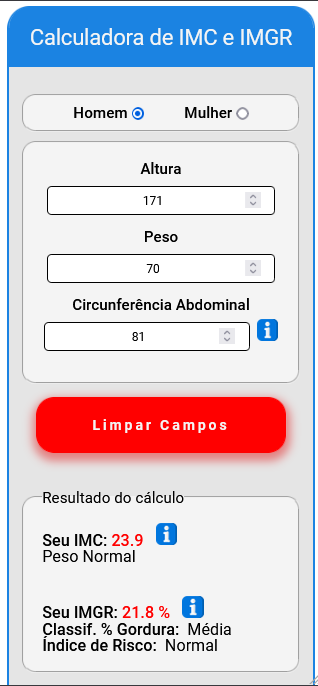
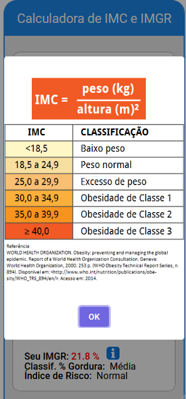
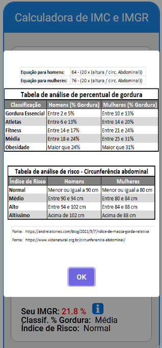

<h1 align="center" style="max-width: 250px; margin: 30px 0;">
    Calculadora de IMC e IMGR :balance_scale:
</h1>
<a href="https://calculadora-imc-imgr.netlify.app/"></img></a>
 
<a href="https://calculadora-imc-imgr.netlify.app/">Aplicativo ONLINE, Clique para acessar!</a> 

<h4 align="center">
  Uma aplicação desenvolvida com HTML + CSS + JavaScript e a biblioteca SweetAlert2 para auxiliar no cálculo do IMC (Índice de Massa Corporal) e do IMGR (Índice de Massa Gorda Relativa).
</h4>
 

## :sunny: Resultado

  

      
      
      
      

